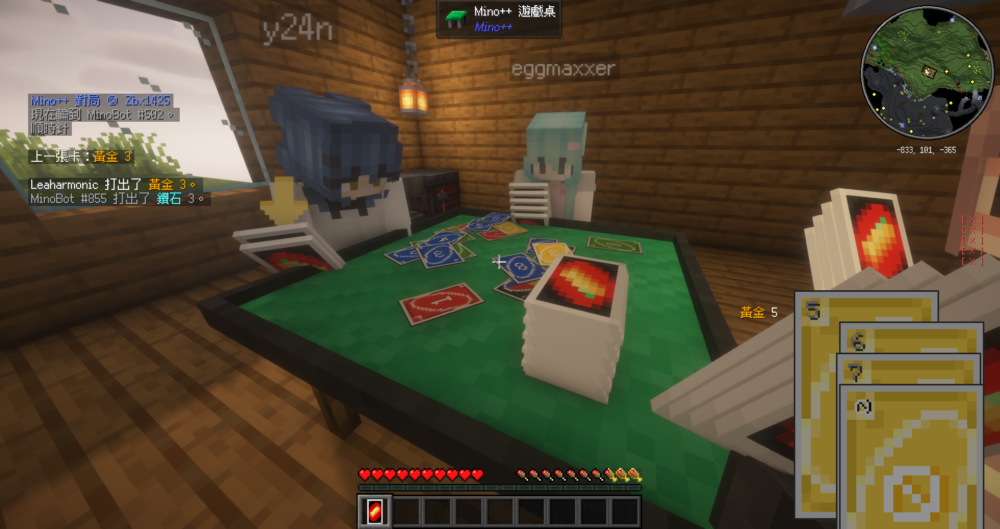
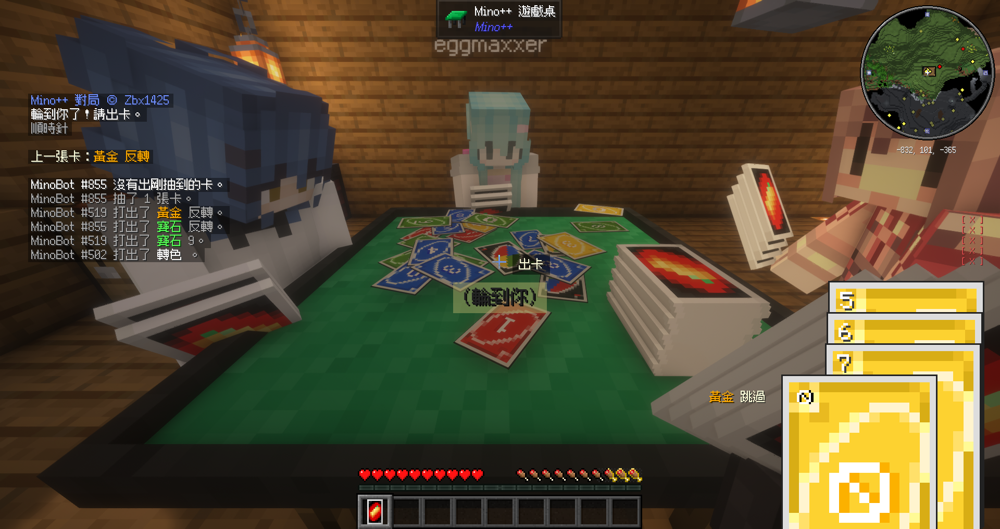

# Mino++ — Fabric 1.21.11 Port

> Play UNO in Minecraft.

https://github.com/user-attachments/assets/d8e8de47-bcf4-4914-93f7-07fd6a1a03cb





A single-version **Fabric / Minecraft 1.21.11** port of
[Zbx1425/minopp](https://github.com/zbx1425/minopp) ("Mino++"), distributed under the
original MIT license.

> English first; 繁體中文在下半部。

---

## English

### About

This is a fork of the original [Mino++](https://github.com/zbx1425/minopp) by
**zbx1425**. Upstream targets multiple loaders and Minecraft versions through a
[stonecutter](https://stonecutter.kikugie.dev/) multi-version setup; this fork is a
**flattened, single-target Fabric 1.21.11 build** — a faithful port that is also a clean,
maintainable single-version fork, not a behavioral rewrite.

For the relationship to upstream, intentional deviations, and known trade-offs, see
[`PORTING.md`](PORTING.md).

### Features

- Play UNO at an in-world table block — with other players or automated (bot) players.
- A config screen for the bot players (powered by YACL).
- In-game hand HUD and card interactions.

### Controls

- Right-click a draw pile to draw a card or to pass; right-click elsewhere to play a card.
- Hold `Ctrl` while playing a card to call **Mino**. Do this while you still have two cards
  in hand — after playing, you'll be down to one.
- If you forget to call Mino while playing, you can type `Mino` in chat to make up for it.
- To challenge someone for not calling Mino, just **hit them**.
- If the table is destroyed while you still hold cards bound to it, right-click the sky with
  the cards in hand to unbind them.

### Rules

Mino++ implements the following rule variant:

- Starting hand: **7** cards.
- The game opens with a non-action card.
- You **may** steal a turn by playing a card identical to the previous one.
- You **may** stack +2 and +4.
- You **may not** play a wild +4 while you still have another playable card in hand. It is
  set as an illegal play, so there is no challenge rule for it.
- You **may** play an action card as your final card.
- Calling Mino while you have more than 1 card in hand incurs a 2-card penalty draw.
- After drawing, you may still play another card from your hand.

### Requirements

| | |
|---|---|
| Minecraft | `1.21.11` |
| Fabric Loader | `>= 0.19.3` |
| Java | `21` |
| [Fabric API](https://modrinth.com/mod/fabric-api) | required |
| [YACL](https://modrinth.com/mod/yacl) (Yet Another Config Lib) | required — powers the config GUI |

The mod runs on both client and server. For multiplayer, install it (and its
dependencies) on the server as well as every client.

### Installation

1. Install [Fabric Loader](https://fabricmc.net/use/installer/) for Minecraft 1.21.11.
2. Drop the following into your `mods/` folder:
   - this mod's jar (from [Releases](../../releases) or built from source)
   - [Fabric API](https://modrinth.com/mod/fabric-api)
   - [YACL](https://modrinth.com/mod/yacl)
3. Launch Minecraft.

### Building from source

Standard Fabric Loom project:

```
./gradlew build
```

The built jar is produced under `build/libs/`.

### Credits & License

- **Original mod:** [Mino++](https://github.com/zbx1425/minopp) by zbx1425 — MIT
- **This fork:** Fabric 1.21.11 port — MIT (see [`LICENSE`](LICENSE))
- **Porting notes:** [`PORTING.md`](PORTING.md)

---

## 繁體中文

### 關於

本專案是 zbx1425 所作 [Mino++](https://github.com/zbx1425/minopp) 的 fork。upstream 透過
[stonecutter](https://stonecutter.kikugie.dev/) 多版本設定同時支援多個 loader 與 Minecraft
版本；本 fork 則是**攤平的單一 Fabric 1.21.11 目標**——一個忠實的移植，同時也是乾淨、好維護的
單版本 fork，而非行為上的重寫。

與 upstream 的關係、刻意偏離之處、已知取捨，詳見 [`PORTING.md`](PORTING.md)。

### 功能

- 在世界中的桌子方塊上玩 UNO——可與其他玩家或自動（bot）玩家對戰。
- bot 玩家的設定畫面（由 YACL 提供）。
- 遊戲內手牌 HUD 與卡牌互動。

### 操作

- 右鍵牌堆抽牌或表示不出，右鍵其他區域出牌。
- 出牌同時按住 `Ctrl` 以喊 **Mino**。這個操作應該在手中還有兩張牌時進行，因為出牌之後就只剩
  一張了。
- 如果忘記了在出牌同時喊 Mino，可以在聊天欄打出 `Mino` 補上。
- 要質疑某人沒有喊 Mino，直接**毆打對方**即可。
- 如果牌桌打掉了但還持有綁定到牌桌的手牌，手持右鍵天空解綁。

### 規則

Mino++ 所實現的規則變種如下：

- 初始手牌數為 **7** 張。
- 以非功能牌開局。
- **可以** 用與前張牌完全一樣的牌搶過回合。
- **可以** 疊加 +2 和 +4。
- **禁止** 在手牌中有其他可出的牌時出轉色 +4。設定為不允許出牌，因此也沒有質疑規則。
- **可以** 以功能牌作為最後一張牌打出。
- 在手牌數多於 1 張時喊 Mino 罰抽 2 張牌。
- 抽牌之後也可以出手中其他的牌。

### 需求

| | |
|---|---|
| Minecraft | `1.21.11` |
| Fabric Loader | `>= 0.19.3` |
| Java | `21` |
| [Fabric API](https://modrinth.com/mod/fabric-api) | 必需 |
| [YACL](https://modrinth.com/mod/yacl)（Yet Another Config Lib） | 必需——設定 GUI 依賴它 |

本 mod 在 client 與 server 端都會運行。多人遊玩時，server 與每個 client 都要安裝本 mod（及其
依賴）。

### 安裝

1. 為 Minecraft 1.21.11 安裝 [Fabric Loader](https://fabricmc.net/use/installer/)。
2. 把以下檔案放進你的 `mods/` 資料夾：
   - 本 mod 的 jar（從 [Releases](../../releases) 下載、或自行 build）
   - [Fabric API](https://modrinth.com/mod/fabric-api)
   - [YACL](https://modrinth.com/mod/yacl)
3. 啟動 Minecraft。

### 從原始碼 build

標準的 Fabric Loom 專案：

```
./gradlew build
```

建置產物位於 `build/libs/`。

### 致謝與授權

- **原作 mod：** [Mino++](https://github.com/zbx1425/minopp) by zbx1425 — MIT
- **本 fork：** Fabric 1.21.11 移植 — MIT（見 [`LICENSE`](LICENSE)）
- **移植說明：** [`PORTING.md`](PORTING.md)
